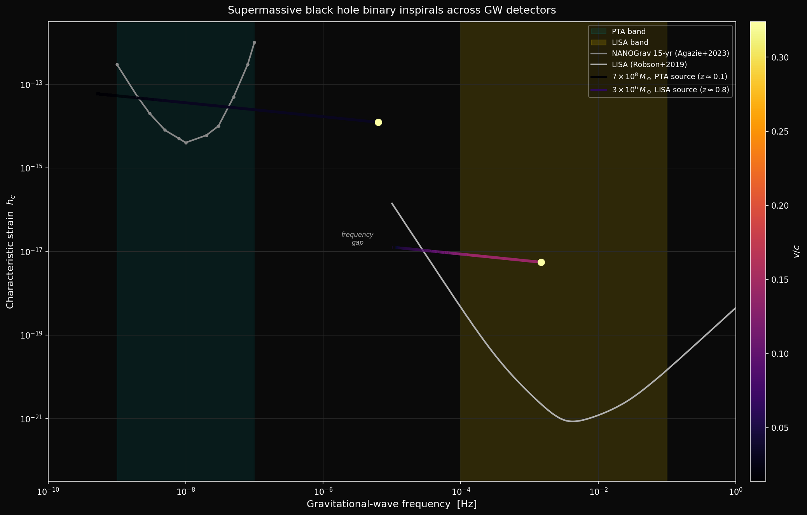
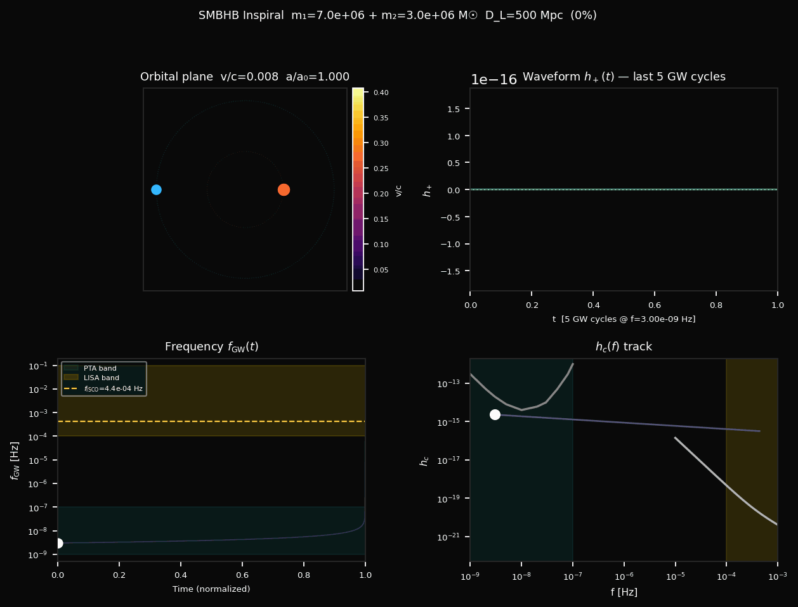

# smbhb-inspiral

This isn't novel work. PyCBC, LALSuite, gwent, and hasasia do all of this better for production pipelines. What I built here is a self-contained Post-Newtonian inspiral simulator for supermassive black hole binaries (SMBHBs) across the 10^5 to 10^10 M_sun mass range, with sensitivity curves for NANOGrav and LISA baked in and an EM detectability lookup tied to published Lomb-Scargle recovery fractions. Treat it as a learning project I built to understand the GW physics, from Peters 1964 to characteristic strain to "what fraction of these things would Stripe 82 actually recover." It's part of a three-repo multi-messenger portfolio: [tng-smbhb-population](https://github.com/WizardEternal/tng-smbhb-population) builds the progenitor population from IllustrisTNG, this repo handles the GW and EM signatures, and [Stripe82-SMBHB-search](https://github.com/WizardEternal/Stripe82-SMBHB-search) goes looking for them in real data.

## The money plot



Two representative SMBHB inspirals plotted as characteristic-strain tracks against the NANOGrav 15-year sensitivity curve (Agazie et al. 2023) and the LISA curve (Robson, Cornish & Liu 2019). The PTA-detectable systems are above roughly 10^8 M_sun; their ISCO frequency lands in the inter-detector gap (100 nHz to 0.1 mHz) and they never enter the LISA band. The LISA-detectable systems are below roughly 10^7 M_sun. The two populations are mass-disjoint. I put them on one plot to show the gap, not because a single system is supposed to show up in both. Color encodes orbital velocity (v/c) via the inferno colormap.



4-panel inspiral animation for the reference system (m1=5e8, m2=2e8 M_sun, f0=3 nHz, d_L=500 Mpc). Upper left is the orbital plane; upper right is the h+ waveform (last ~50 cycles); lower left is f_GW evolution with PTA/LISA band shading; lower right is the h_c track moving through the sensitivity diagram in real time. Regenerate it with `python -m smbhb_inspiral.scripts.make_animation`.

## Background

A supermassive black hole binary forms after two galaxies merge and their central black holes sink to the center of the remnant by dynamical friction, eventually reaching sub-parsec separations where gravitational-wave emission takes over orbital decay. The Peters (1964) quadrupole formula gives the rate of frequency evolution as df/dt proportional to f^(11/3) times M_c^(5/3), where M_c is the chirp mass. Integrating that ODE forward from some initial GW frequency gives the inspiral trajectory: orbital frequency, separation, and phase as a function of time until the ISCO.

SMBHBs sit in two observationally distinct bands. The pulsar timing array (PTA) band covers roughly 1-100 nHz. NANOGrav's 15-year data set (Agazie et al. 2023) detected a stochastic GW background consistent with a population of SMBHBs with masses around 10^8 M_sun and above. The LISA band covers roughly 0.1-100 mHz, targeting lower-mass systems (10^5 to 10^7 M_sun) at earlier inspiral stages; launch is expected mid-2030s (Amaro-Seoane et al. 2017). These two populations are mass-disjoint because the ISCO frequency scales inversely with total mass: a 7e8 M_sun binary reaches ISCO at about 6 microHz, squarely in the inter-detector gap between 100 nHz and 0.1 mHz.

The characteristic strain h_c(f) = h(f) sqrt(f^2 / |df/dt|) per Sesana et al. (2008) is what you compare against sensitivity curves in the h_c vs f plane. I implemented it both analytically (from the Peters formula) and from the numerically integrated trajectory, and the two agree well above a few percent of the ISCO frequency.

On the EM side: SMBHBs at sub-parsec separations can produce periodic optical variability through Doppler boosting, accretion modulation, or circumbinary disk dynamics. But Lomb-Scargle (LS) period searches, the standard tool for optical SMBHB searches, are bad at this. Lin, Charisi & Haiman (2026, ApJ 997, 316) ran injection-recovery tests on DRW-contaminated light curves and found that LS recovers about 45% of sinusoidal signals under PTF-like cadence, dropping to about 23% for LSST-like cadence. For sawtooth signals, which are the more physically realistic shape from circumbinary-disk hydro simulations, it's about 9% (PTF) and 1% (LSST). So LS probably misses most real SMBHBs regardless of what survey you're running. The em_detectability module in this repo encodes those numbers.

## Three-repo portfolio context

This repo exists because the three-project arc needs a middle piece. IllustrisTNG tells you what the progenitor population looks like. This repo tells you what their GW and EM signatures look like for individual systems across the full mass range. Stripe82 applies the search to real data. Without this middle repo you don't have a way to connect a TNG merger event to a detector sensitivity curve or an LS recovery probability.

| Repo | Question it answers | What it does |
|------|---------------------|--------------|
| [tng-smbhb-population](https://github.com/WizardEternal/tng-smbhb-population) | What does the progenitor population look like? | IllustrisTNG BH merger catalog, GW band classification, EM detectability |
| **smbhb-inspiral** (this repo) | What do their GW and EM signatures look like? | Post-Newtonian inspiral, sensitivity curves, EM lookup |
| [Stripe82-SMBHB-search](https://github.com/WizardEternal/Stripe82-SMBHB-search) | Can we find them in real data? | DRW + Lomb-Scargle in SDSS Stripe 82 |


Funnel plot generated by [tng-smbhb-population](https://github.com/WizardEternal/tng-smbhb-population). Roughly 5000 TNG merger proxies drop by orders of magnitude at each cut (GW band, EM window, LS recovery), and what's left at the bottom is a handful of candidates Stripe 82 could plausibly recover. That's the context for why the per-system GW/EM calculations in this repo exist.

## What's in here

```
smbhb-inspiral/
  README.md
  pyproject.toml
  src/smbhb_inspiral/
    physics.py          Peters 1964 + 1PN ODE integrator
    waveform.py         h+, hx polarizations; h_c(f) analytic and track-based
    sensitivity.py      NANOGrav 15-yr curve + LISA Robson+2019 analytic fit
    em_detectability.py Lin+2026 recovery fractions for Stripe82/PTF/LSST
    animation.py        4-panel inspiral animation
    constants.py        G, c, M_sun, pc, Mpc, yr (SI)
    scripts/            CLI entry points (run_inspiral, make_animation)
  tests/                86 pytest tests
  outputs/              money plot, animation, funnel figure
  docs/                 equations.md (270 LOC of derivations)
```

## How to run

```bash
git clone https://github.com/WizardEternal/smbhb-inspiral.git
cd smbhb-inspiral
pip install -e ".[dev]"
```

Python 3.10+. Core dependencies: `numpy`, `scipy`, `matplotlib`.

### CLI

```bash
python -m smbhb_inspiral.scripts.run_inspiral \
    --m1 5e8 --m2 2e8 --f0 3e-9 --distance 500 --redshift 0.1
```

Outputs to `outputs/`: a trajectory CSV, a waveform plot (h+ vs time, last ~50 cycles), and a frequency evolution plot with PTA/LISA band shading. Pass `--no-plots` for headless runs.

### Python API

```python
from smbhb_inspiral import integrate_inspiral, characteristic_strain_analytic
from smbhb_inspiral.em_detectability import classify_system

# Integrate the inspiral trajectory
traj = integrate_inspiral(m1=5e8, m2=2e8, f0=3e-9, pn_order=1)

# Compute characteristic strain at each frequency step
h_c = characteristic_strain_analytic(
    f_hz=traj.f_gw,
    chirp_mass_msun=traj.chirp_mass_msun,
    d_l_mpc=500.0,
)

# EM survey detectability
result = classify_system(m_total_msun=7e8, f_gw_hz=3e-9, z=0.1)
print(result.in_stripe82_window)           # True/False
print(result.recovery_sawtooth_stripe82)   # e.g. 0.09
```

## Modules

| Module | What's in it |
|--------|--------------|
| `physics.py` | Peters (1964) + 1PN ODE integrator; `integrate_inspiral`, `chirp_mass`, `f_isco`, `InspiralTrajectory` |
| `waveform.py` | h+(t) and hx(t) polarizations; analytic and track-based characteristic strain h_c(f) |
| `sensitivity.py` | NANOGrav 15-yr curve (digitized from Agazie+2023 Fig. 1) and LISA analytic fit (Robson+2019) |
| `em_detectability.py` | LS recovery fractions for Stripe 82, PTF, and LSST from Lin+2026; `classify_system`, `classify_system_from_separation` |
| `animation.py` | 4-panel inspiral animation; Pillow writer, no FFmpeg needed |
| `constants.py` | G, c, M_sun, pc, Mpc, yr in SI |

## Stuff that went sideways (and how I noticed)

1. **Observer-frame vs source-frame f_ISCO.** My first cut at the band classifier in tng-smbhb-population was using source-frame ISCO frequencies to assign systems to PTA vs LISA vs gap. That inflated the LISA-band counts because high-redshift systems appear at lower observed frequency. Fixed by dividing by (1+z) to get the observer-frame frequency before classifying.

2. **1PN breaks down near merger.** The 1PN correction helps when v/c is around 0.1-0.3 but falls apart as you get close to the ISCO where v/c approaches 0.3 and higher. I noticed the frequency evolution was going nonphysical in the last few orbits. The animation freezes before ISCO rather than trying to continue into a regime where the approximation is actively wrong.

## Limitations

1. **Circular orbits only.** Real SMBHBs retain eccentricity from stellar hardening and disk interaction. Eccentricity redistributes GW power across harmonics and modifies the inspiral timescale significantly. See Peters (1964), Sesana et al. (2010), Kelley et al. (2017).

2. **No environmental coupling.** Orbital decay at 0.01-1 pc is driven by stellar scattering and circumbinary gas torques, not GW emission. GW-only evolution is valid only where radiation reaction dominates, roughly below ~0.01 pc for a 10^8 M_sun binary. At larger separations the environment sets the timescale, not the quadrupole formula. See Haiman, Kocsis & Menou (2009).

3. **1PN accuracy breaks down at v/c above 0.3.** The waveform is unreliable in the last few orbits before merger. If you need accurate merger waveforms, use numerical relativity surrogates.

4. **No full cosmological corrections on the GW side.** The EM detectability module applies the (1+z) period correction correctly. But the GW strain and sensitivity comparisons don't apply redshifted-frequency or luminosity-distance corrections beyond the 1/D_L amplitude factor. Source-frame and observer-frame frequencies are not distinguished in the trajectory output.

5. **Sensitivity curves are approximate.** The NANOGrav 15-yr curve is digitized from Agazie+2023 Fig. 1 (~11 points, log-log interpolated). The LISA curve uses the Robson+2019 analytic fit. Neither is a substitute for a full noise model. For production PTA sensitivity, use hasasia.

6. **EM recovery fractions are population averages, not per-system.** The em_detectability module uses aggregate LS recovery fractions from Lin+2026: ~45%/~9% (sinusoidal/sawtooth) for PTF-like cadence, ~23%/~1% for LSST-like. Per-system rates depend on DRW parameters, signal amplitude, and observing cadence in ways that would need a separate injection-recovery campaign to characterize.

7. **PTA and LISA populations are mass-disjoint.** The money plot shows them on one axis so the gap is visible. A 7e8 M_sun binary reaches ISCO at ~6 microHz, firmly in the inter-detector gap. No single system shows up in both detectors.

8. **No spin.** BH spin is zero throughout (Schwarzschild ISCO, spin-zero-limit 1PN per Blanchet 2014 Eq. 234). IllustrisTNG doesn't evolve BH spin either (sink-particle Bondi model), so there's no honest way to propagate spin through the full pipeline without adding separate population-synthesis input.

## References

- Agazie et al. 2023, ApJL 951, L8. *The NANOGrav 15 yr Data Set: Evidence for a Gravitational-wave Background.* [arXiv:2306.16213](https://arxiv.org/abs/2306.16213)
- Amaro-Seoane et al. 2017, [arXiv:1702.00786](https://arxiv.org/abs/1702.00786). *Laser Interferometer Space Antenna.*
- Blanchet 2014, Living Rev. Relativity 17, 2. *Gravitational Radiation from Post-Newtonian Sources and Inspiralling Compact Binaries.*
- Haiman, Kocsis & Menou 2009, ApJ 700, 1952. *The Population of Viscosity- and Gravitational Wave-Driven Supermassive Black Hole Binaries Among Luminous Active Galactic Nuclei.*
- Lin, Charisi & Haiman 2026, ApJ 997, 316. *Lomb-Scargle Periodogram Struggles with Non-sinusoidal Supermassive Black Hole Binary Signatures in Quasar Lightcurves.*
- Peters 1964, Phys. Rev. 136, B1224. *Gravitational Radiation and the Motion of Two Point Masses.*
- Robson, Cornish & Liu 2019, CQG 36, 105011. *The construction and use of LISA sensitivity curves.*
- Sesana, Vecchio & Colacino 2008, MNRAS 390, 192. *The stochastic gravitational-wave background from massive black hole binary systems: implications for observations with Pulsar Timing Arrays.*

## Author

Karan Akbari, MSc Astrophysics, St. Xavier's College Mumbai. Background is X-ray timing and spectral analysis of black hole X-ray binaries (GRS 1915+105, 4U 1630-47) with Dr. Sudip Bhattacharyya at TIFR. Built this as part of a three-repo SMBHB multi-messenger portfolio while bridging into GW/compact-object follow-up work.

## License

MIT. See [LICENSE](LICENSE).
